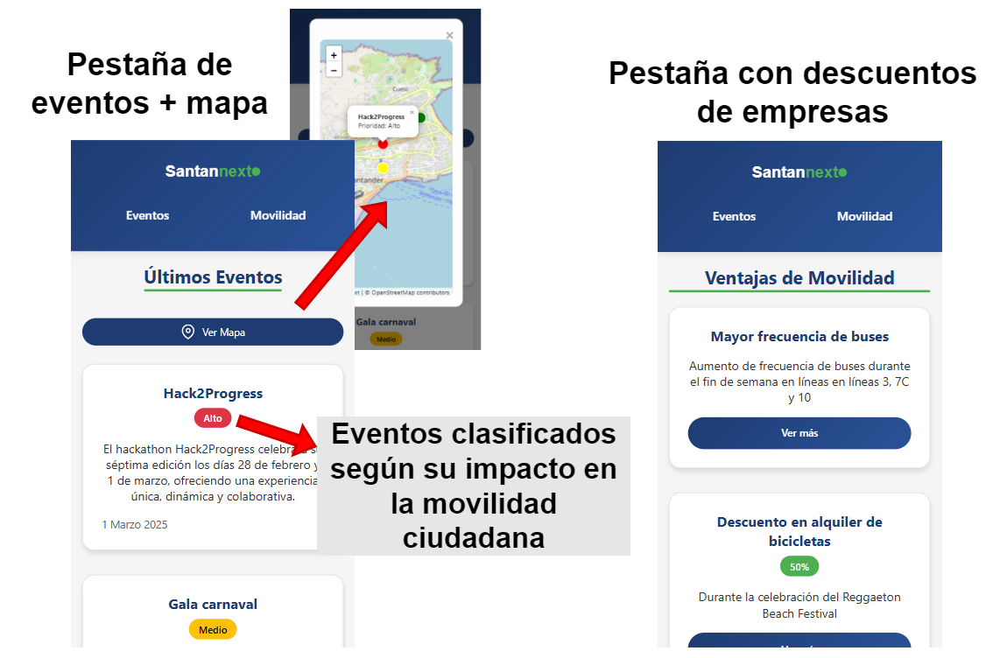

---

Nuestra solución para la VII Edición del Hack2Progress cuyo lema es "Transforma tu ciudad: Desafío por la movilidad sostenible."

Nosotros proponemos Santan'next. Santan'next se basa en emplear agentes de IA que identificarán eventos relevantes en la ciudad de Santander que puedan generar un aumento de tráfico en la ciudad.

Una vez identificados y procesados los eventos relevantes, se proporcionarán a diferentes stakeholders:
- Empresas:
    - De modo que puedan tomar decisiones sobre __cómo abordar el aumento de tráfico__ (Por ejemplo, añadir descuentos en carsharing o bicicletas eléctricas, o aumento de frecuencia de transporte público)
 
- Usuarios:

  - Dispondrán de una interfaz que mostrará los eventos relevantes y los descuentos generados por las empresas.  
    
    {: style="width:50%;"}

