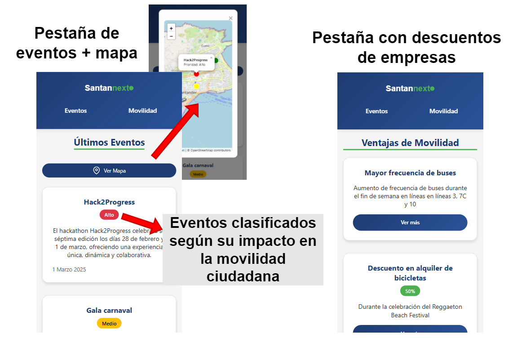
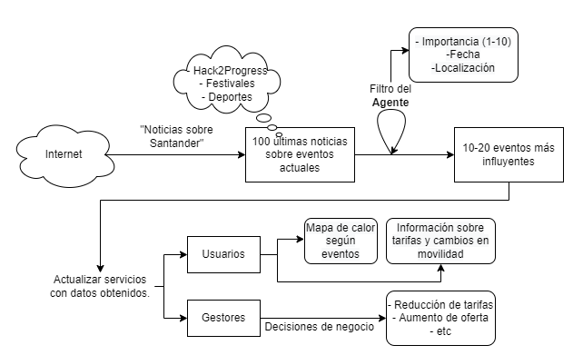
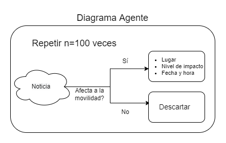

---

Nuestra solución para la VII Edición del Hack2Progress cuyo lema es "Transforma tu ciudad: Desafío por la movilidad sostenible."

| Proponemos __Santan'next__. Santan'next se basa en emplear __agentes de IA__ que identificarán __eventos relevantes__ en la ciudad de Santander que puedan generar un __aumento de tráfico__ en la ciudad.

Una vez identificados y procesados los eventos relevantes, se proporcionarán a diferentes stakeholders:
- __Empresas:__
    - De modo que puedan tomar decisiones sobre __cómo abordar el aumento de tráfico__ (Por ejemplo, añadir descuentos en carsharing o bicicletas eléctricas, o aumento de frecuencia de transporte público)
 
- __Usuarios:__

  - Dispondrán de una interfaz que mostrará los eventos relevantes y los descuentos generados por las empresas: 

    

    

## Flujo de la solución

    

## Flujo de agente

    

## Estructura del repositorio

- `web/`: Código fuente de la web de Santan'next.
- `main.py`: Al ejecutarlo se genera un mapa HTML con las líneas de autobuses de Santander y espiras de tráfico. (No relevante para el hackathon)
- `src/news.py`: __Prueba de concepto__ de agente de IA que genera noticias relevantes de la ciudad de Santander. Usa la api de `NewsAPI` para obtener `n` noticias y las clasifica según el modelo `deepseek-v3`.
- `src/news_output.md`: Resultado de la prueba de concepto al ejecutar `news.py`.

Finalmente, una presentación en formato PDF con la explicación de nuestra propuesta se encuentra en `presentation\Hack2Progress.pdf`
